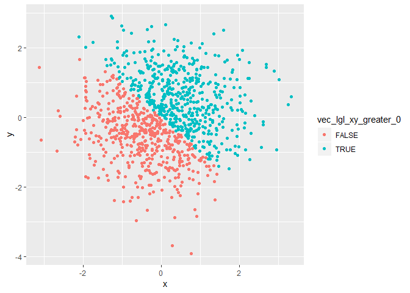
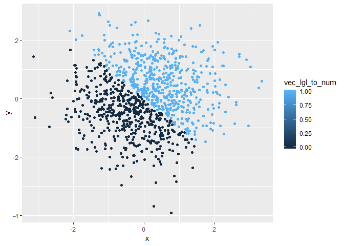
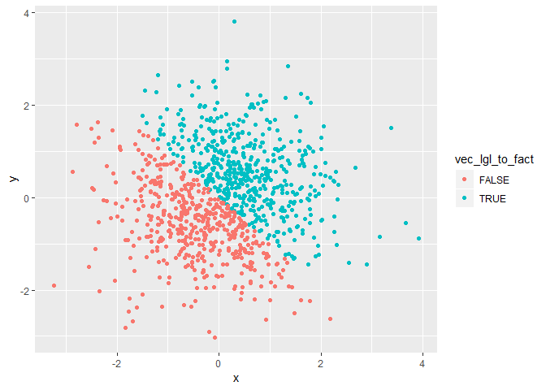

p8105\_hw1\_hh2767
================
Haoran Hu
2018-09-18

Problem 1
=========

Creating a data frame
---------------------

In this part, I will construct a data frame with four columns. From left to right, the four columns are: a random sample of size 10 from a uniform \[0, 5\] distribution, a logical vector indicating whether elements of the sample are greater than 2, a length-10 character vector, and a length-10 factor vector.

``` r
problem1_df = tibble(
  vec_unif = runif(10, min = 0, max = 5),
  vec_lgl_greater_2 = ifelse(vec_unif > 2, TRUE, FALSE),
  vec_char = c("I", "am", "doing", "my", "second", "hw", "of", "p8015", "data", "science"),
  vec_factor = factor(c("male", "female", "male", "female", "male", "male",     "female", "male", "female", "male"))
  )
```

The data frame is as below:

    ## # A tibble: 10 x 4
    ##    vec_unif vec_lgl_greater_2 vec_char vec_factor
    ##       <dbl> <lgl>             <chr>    <fct>     
    ##  1    2.75  TRUE              I        male      
    ##  2    3.33  TRUE              am       female    
    ##  3    2.70  TRUE              doing    male      
    ##  4    3.20  TRUE              my       female    
    ##  5    3.46  TRUE              second   male      
    ##  6    0.972 FALSE             hw       male      
    ##  7    0.574 FALSE             of       female    
    ##  8    4.44  TRUE              p8015    male      
    ##  9    0.363 FALSE             data     female    
    ## 10    3.20  TRUE              science  male

Take the mean of each variable in the data frame
------------------------------------------------

In this part, I will try to take the mean of each variable in the data frame. It only wroked for the first column(vec\_nuif) and the second column(vec\_lgl\_greater\_2).

``` r
mean_vec_unif = mean(problem1_df$vec_unif)
mean_vec_lgl_greater_2 = mean(problem1_df$vec_lgl_greater_2)
```

The mean of "vec\_unif" variable is 2.498537, and the mean of "vec\_lgl\_greater\_2" variable is 0.7. The mean of "vec\_unif" is directly calculated, while the mean of "vec\_lgl\_greater\_2" was calculated by treating "TRUE" as numerical "1", and "FALSE" as numerical "2". The mean of "vec\_char" and "vec\_factor" cannot be calculated, because they are neither numerical value nor lgl value, and if we calculate the mean of them, the outputs will be displayed as NAs.

Convert variables from one type to another
------------------------------------------

In this part, I will apply the "as.numeric" function to the logical, character, and factor variables, but the output will not be shown.

``` r
as.numeric(problem1_df$vec_lgl_greater_2)
as.numeric(problem1_df$vec_char)
as.numeric(problem1_df$vec_factor)
```

In the following chunk, I will try converting "vec\_char" from character to factor to numeric, and converting "vec\_factor" from factor to character to numeric.

``` r
problem1_df$vec_char = as.factor(problem1_df$vec_char) #converting vec_char from character to factor
problem1_df$vec_char = as.numeric(problem1_df$vec_char) #converting vec_char from factor to numeric
problem1_df$vec_factor = as.character(problem1_df$vec_factor) #converting vec_factor from factor to character
problem1_df$vec_factor = as.numeric(problem1_df$vec_factor) #converting vec_factor from character to numeric
```

    ## Warning: 强制改变过程中产生了NA

The result is as below:

    ## # A tibble: 10 x 4
    ##    vec_unif vec_lgl_greater_2 vec_char vec_factor
    ##       <dbl> <lgl>                <dbl>      <dbl>
    ##  1    2.75  TRUE                     5         NA
    ##  2    3.33  TRUE                     1         NA
    ##  3    2.70  TRUE                     3         NA
    ##  4    3.20  TRUE                     6         NA
    ##  5    3.46  TRUE                    10         NA
    ##  6    0.972 FALSE                    4         NA
    ##  7    0.574 FALSE                    7         NA
    ##  8    4.44  TRUE                     8         NA
    ##  9    0.363 FALSE                    2         NA
    ## 10    3.20  TRUE                     9         NA

Therefore, we can successfully convert character to factor to numeric, but we cannot convert factor to character to numeric, because NAs are introduced by coercion when converting character to numeric.

Problem 2
=========

Creating a data frame
---------------------

The following chunk creates a data frame with 5 columns. From left to right, the columns are a random sample of size 1000 from a standard Normal distribution, a random sample of size 1000 from a standard Normal distribution, a logical vector indicating whether the x + y &gt; 0, a numeric vector created by coercing the above logical vector, and a factor vector created by coercing the above logical vector, respectively.

``` r
problem2_df = tibble(
  x = rnorm(1000, mean = 0, sd = 1),
  y = rnorm(1000, mean = 0, sd = 1),
  vec_lgl_xy_greater_0 = ifelse((x + y) > 0, TRUE, FALSE),
  vec_lgl_to_num = as.numeric(vec_lgl_xy_greater_0),
  vec_lgl_to_fact = as.factor(vec_lgl_xy_greater_0)
  )
problem2_df
```

    ## # A tibble: 1,000 x 5
    ##          x       y vec_lgl_xy_greater_0 vec_lgl_to_num vec_lgl_to_fact
    ##      <dbl>   <dbl> <lgl>                         <dbl> <fct>          
    ##  1 -0.651   0.334  FALSE                             0 FALSE          
    ##  2  0.0348 -0.280  FALSE                             0 FALSE          
    ##  3 -1.93   -1.64   FALSE                             0 FALSE          
    ##  4  1.02    0.593  TRUE                              1 TRUE           
    ##  5  0.757  -0.0918 TRUE                              1 TRUE           
    ##  6  0.792   0.198  TRUE                              1 TRUE           
    ##  7  0.897  -0.751  TRUE                              1 TRUE           
    ##  8  1.25   -0.844  TRUE                              1 TRUE           
    ##  9 -0.263  -2.33   FALSE                             0 FALSE          
    ## 10 -2.08    0.206  FALSE                             0 FALSE          
    ## # ... with 990 more rows

The data frame is a 1000 \* 5 data set. The mean of x is -0.0081137, and the median of x is -0.0524882.The proportion of cases for which the logical vector is TRUE is 0.5.

Scatterplot colored in different ways
-------------------------------------

A scatterplot that color points using the logical variable is as below. The plot is exported to the project directory using ggsave.

``` r
ggplot(problem2_df, aes(x = x, y = y, color = vec_lgl_xy_greater_0)) + geom_point()
```



``` r
ggsave("scatplot_bylgl.pdf", height = 4, width = 6, path = "..\\plot")
```

A scatterplot that color points using the numeric variable is as below.

``` r
ggplot(problem2_df, aes(x = x, y = y, color = vec_lgl_to_num)) + geom_point()
```

 A scatterplot that color points using the factor variable is as below.

``` r
ggplot(problem2_df, aes(x = x, y = y, color = vec_lgl_to_fact)) + geom_point()
```

 As the plots show, when color points using logical or factor vectors, the color scale is two colors: orange and green, which refer to TRUE and FALSE; when color points using numerical vector, the color can change from dark blue to light blue, and this color scale refers to the range \[0,1\].
